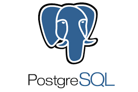

<h1> 👋 Hello, I'm Arjun Baidya </h1>

<h4>A full time Software Developer and content creator on Python,JavaScript,Go,Django,React Js,Node JS,Odoo and web technology.</h4>

 
 

 
 
<h1> About Me </h1>

    I am a full-time full-stack Software Developer with a couple of years of industry experience. In the industry, I worked on  Python, C, JavaScript, Go, React, Django, Node JS, Odoo, PostgreSQL, MongoDB, MySql, Firebase. I big of time in my development career I spend web development. I have good knowledge of React JS.
    Teaching is my another good skill. My Interested tech area is data science, machine learning, and AI.
    Every day I try to learn something and share my knowledge in the community.

 
 
 

<h1>Skills </h1>

 
  
  
  
  
  
   
  
  
  
  
  
  
   
  
  
  
  
  
  
  
  